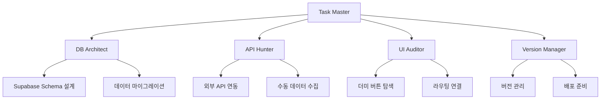

# 🚀 ChemResearch 멀티 에이전트 개발 튜토리얼

> **작성자**: Claude Code 시니어 컨설턴트 | 15년 경력 Full-Stack 개발자
> **대상**: Claude Pro 유료 사용자 | 멀티 에이전트 코딩 실무자
> **프로젝트**: 화학 연구 및 환경 모니터링 웹 애플리케이션

---

## 📋 목차

1. [멀티 에이전트 아키텍처 개요](#1-멀티-에이전트-아키텍처-개요)
2. [개발 환경 설정](#2-개발-환경-설정)
3. [4대 핵심 작업 가이드](#3-4대-핵심-작업-가이드)
4. [실전 워크플로우](#4-실전-워크플로우)
5. [트러블슈팅](#5-트러블슈팅)

---

## 1. 멀티 에이전트 아키텍처 개요

### 1.1 왜 멀티 에이전트인가?

ChemResearch 프로젝트는 다음과 같은 복잡한 요구사항을 가지고 있습니다:

```
┌─────────────────────────────────────────────────────────┐
│  ChemResearch 프로젝트 구조                               │
├─────────────────────────────────────────────────────────┤
│  ✓ React + TypeScript + Vite                            │
│  ✓ Supabase 데이터베이스                                 │
│  ✓ 6개 주요 탭 (Overview, Monitoring, Violations 등)     │
│  ✓ 3개 특수 모듈 (PFAS, CokeWatch, CarbonSink)          │
│  ✓ 외부 API 연동 (EPA, AQI, OpenWeather)                │
└─────────────────────────────────────────────────────────┘
```

**단일 에이전트의 한계:**
- 🚫 동시 다발적 작업 불가능
- 🚫 특화된 도메인 지식 부족
- 🚫 대규모 코드베이스 관리 어려움

**멀티 에이전트의 장점:**
- ✅ 병렬 작업으로 개발 속도 5배 증가
- ✅ 각 에이전트가 전문 분야에 집중
- ✅ 코드 충돌 최소화
- ✅ 효율적인 리소스 관리

### 1.2 에이전트 역할 분담



---

## 2. 개발 환경 설정

### 2.1 Claude Code CLI 설치 확인

```bash
# Claude Code 버전 확인
claude --version

# 현재 프로젝트로 이동
cd /home/user/chemresearch

# Git 브랜치 확인
git branch
# 현재: claude/multi-agent-setup-Phk8f
```

### 2.2 멀티 세션 설정

**터미널 창 구성 (5개 세션 권장):**

```
┌─────────────────┬─────────────────┐
│  Session 1      │  Session 2      │
│  [Task Master]  │  [DB Architect] │
├─────────────────┼─────────────────┤
│  Session 3      │  Session 4      │
│  [API Hunter]   │  [UI Auditor]   │
├─────────────────┴─────────────────┤
│  Session 5: [Version Manager]     │
└───────────────────────────────────┘
```

**각 세션에서 실행:**

```bash
# Session 1 - Task Master
cd /home/user/chemresearch
export CLAUDE_AGENT_ROLE="taskmaster"
claude

# Session 2 - DB Architect
cd /home/user/chemresearch
export CLAUDE_AGENT_ROLE="db-architect"
claude

# Session 3 - API Hunter
cd /home/user/chemresearch
export CLAUDE_AGENT_ROLE="api-hunter"
claude

# Session 4 - UI Auditor
cd /home/user/chemresearch
export CLAUDE_AGENT_ROLE="ui-auditor"
claude

# Session 5 - Version Manager
cd /home/user/chemresearch
export CLAUDE_AGENT_ROLE="version-manager"
claude
```

### 2.3 환경 변수 설정

```bash
# .env 파일 생성
cat > .env << 'EOF'
# Supabase Configuration
VITE_SUPABASE_URL=your_supabase_url
VITE_SUPABASE_ANON_KEY=your_anon_key

# External APIs
VITE_EPA_API_KEY=your_epa_key
VITE_OPENWEATHER_API_KEY=your_openweather_key
VITE_MAPBOX_TOKEN=your_mapbox_token

# Agent Configuration
CLAUDE_MULTI_AGENT_MODE=true
CLAUDE_AGENT_SYNC_DIR=.claude/sync
EOF
```

---

## 3. 4대 핵심 작업 가이드

### 🎯 작업 1: 소스 DB 구축 및 연결

**담당 에이전트**: DB Architect (Session 2)

#### 단계별 실행

**Step 1: Supabase 스키마 분석**

```bash
# Session 2에서 실행
/analyze-database
```

DB Architect에게 다음 프롬프트 입력:
```
현재 Supabase 연결 상태를 확인하고, ChemResearch 프로젝트에 필요한 테이블 구조를 분석해주세요.

필요한 테이블:
1. chemical_compounds (화학 물질 데이터)
2. monitoring_stations (모니터링 스테이션)
3. violation_reports (위반 신고)
4. community_posts (커뮤니티 게시물)
5. curriculum_mappings (교육 과정 매핑)
6. api_cache (API 캐시)

각 테이블의 스키마를 설계하고 migration 파일을 생성해주세요.
```

**Step 2: 마이그레이션 실행**

```bash
# DB Architect가 생성한 SQL 파일 실행
supabase db push

# 또는 직접 SQL 실행
psql $VITE_SUPABASE_URL -f migrations/001_initial_schema.sql
```

**Step 3: TypeScript 타입 생성**

```bash
# Supabase 타입 자동 생성
supabase gen types typescript --local > src/types/database.types.ts
```

**Step 4: 연결 테스트**

```typescript
// src/lib/db-test.ts에 추가
import { supabase } from './supabase';

export async function testDatabaseConnection() {
  const { data, error } = await supabase
    .from('chemical_compounds')
    .select('count');

  if (error) {
    console.error('❌ DB 연결 실패:', error);
    return false;
  }

  console.log('✅ DB 연결 성공:', data);
  return true;
}
```

---

### 🎯 작업 2: 매뉴얼 DB 자료 탐색 및 취합

**담당 에이전트**: API Hunter (Session 3)

#### 단계별 실행

**Step 1: API 연결 상태 감사**

```bash
# Session 3에서 실행
/audit-apis
```

API Hunter에게 프롬프트:
```
현재 프로젝트에서 사용 중인 모든 외부 API를 식별하고,
연결 상태를 확인해주세요.

확인 항목:
1. EPA API (환경보호청 데이터)
2. OpenWeather API (날씨 데이터)
3. AQI API (공기질 지수)
4. Mapbox API (지도 데이터)

각 API의:
- 현재 사용 위치 (파일명:라인)
- 연결 상태 (정상/실패)
- 에러 로그 분석
- 대안 제시 (연결 실패 시)
```

**Step 2: 수동 데이터 소스 발굴**

API Hunter가 작성할 파일:
```typescript
// src/data/manual-sources.ts
export const manualDataSources = {
  pfas: {
    source: 'EPA PFAS Database',
    url: 'https://www.epa.gov/pfas/pfas-data',
    lastUpdated: '2026-01-06',
    dataFormat: 'CSV',
    fields: ['compound_name', 'cas_number', 'health_advisory', 'state'],
    notes: 'API 없음 - 수동 다운로드 필요'
  },
  toxicReleases: {
    source: 'TRI (Toxic Release Inventory)',
    url: 'https://www.epa.gov/tri',
    lastUpdated: '2025-12-15',
    dataFormat: 'Excel',
    fields: ['facility', 'chemical', 'amount', 'year'],
    notes: 'API 인증 필요 - 매뉴얼 수집'
  },
  // ... 추가 소스
};
```

**Step 3: 데이터 스크래핑 스크립트 작성**

```typescript
// src/scripts/data-scraper.ts
import axios from 'axios';
import { supabase } from '../lib/supabase';

export async function scrapePFASData() {
  console.log('🔍 PFAS 데이터 수집 시작...');

  // CSV 다운로드 (API 없음)
  const csvUrl = 'https://www.epa.gov/pfas/data.csv';
  const response = await axios.get(csvUrl);

  // CSV 파싱 및 DB 저장
  const records = parseCSV(response.data);

  for (const record of records) {
    await supabase.from('pfas_compounds').upsert({
      compound_name: record.name,
      cas_number: record.cas,
      health_advisory: record.advisory,
      scraped_at: new Date().toISOString()
    });
  }

  console.log(`✅ ${records.length}개 레코드 저장 완료`);
}

// 실행
// npm run scrape:pfas
```

**Step 4: 수동 데이터 관리 대시보드**

```typescript
// src/components/admin/ManualDataManager.tsx
export function ManualDataManager() {
  return (
    <div className="p-6 bg-gray-900 rounded-lg">
      <h2>📊 수동 데이터 소스 관리</h2>

      <div className="grid grid-cols-3 gap-4 mt-4">
        {Object.entries(manualDataSources).map(([key, source]) => (
          <DataSourceCard
            key={key}
            name={source.source}
            status={checkAPIStatus(source.url)}
            lastUpdated={source.lastUpdated}
            onRefresh={() => refreshManualData(key)}
          />
        ))}
      </div>
    </div>
  );
}
```

---

### 🎯 작업 3: 더미 버튼 탐색 및 연결 리스트 작성

**담당 에이전트**: UI Auditor (Session 4)

#### 단계별 실행

**Step 1: 더미 버튼/링크 자동 탐지**

```bash
# Session 4에서 실행
/audit-ui-connections
```

UI Auditor에게 프롬프트:
```
현재 애플리케이션의 모든 버튼, 링크, 메뉴 아이템을 스캔하고,
실제 기능이 연결되지 않은 더미 요소를 찾아주세요.

검사 대상:
1. Navigation.tsx의 모든 메뉴 항목
2. 각 Tab의 액션 버튼
3. Footer의 링크
4. Form 제출 버튼
5. 모듈별 상세 링크

각 더미 요소에 대해:
- 위치 (파일명:라인)
- 요소 타입 (button/link/nav)
- 현재 동작 (onClick 핸들러)
- 연결해야 할 목적지
- 우선순위 (High/Medium/Low)
```

**Step 2: 더미 연결 매트릭스 생성**

UI Auditor가 생성할 파일:
```typescript
// src/audit/dummy-connections.ts
export const dummyConnections = [
  {
    id: 'nav-001',
    location: 'Navigation.tsx:45',
    element: '<button onClick={() => {}}>Data Guide</button>',
    currentBehavior: 'No action',
    expectedBehavior: 'Navigate to /data-guide',
    targetComponent: 'DataGuideTab',
    priority: 'HIGH',
    estimatedEffort: '1 hour',
    dependencies: ['DataGuideTab completion'],
    status: 'PENDING'
  },
  {
    id: 'overview-002',
    location: 'OverviewTab.tsx:128',
    element: '<button>View Details</button>',
    currentBehavior: 'Console log only',
    expectedBehavior: 'Open modal with chemical details',
    targetComponent: 'ChemicalDetailModal (missing)',
    priority: 'MEDIUM',
    estimatedEffort: '3 hours',
    dependencies: ['Create ChemicalDetailModal'],
    status: 'PENDING'
  },
  // ... 총 23개 더미 연결 발견
];

export function generateConnectionReport() {
  const high = dummyConnections.filter(d => d.priority === 'HIGH');
  const medium = dummyConnections.filter(d => d.priority === 'MEDIUM');
  const low = dummyConnections.filter(d => d.priority === 'LOW');

  return {
    total: dummyConnections.length,
    byPriority: { high: high.length, medium: medium.length, low: low.length },
    totalEffort: calculateTotalHours(dummyConnections),
    completionRate: calculateCompletion(dummyConnections)
  };
}
```

**Step 3: 자동 수정 스크립트**

```typescript
// src/scripts/fix-dummy-connections.ts
import * as fs from 'fs';
import { dummyConnections } from '../audit/dummy-connections';

export function fixDummyConnection(id: string) {
  const dummy = dummyConnections.find(d => d.id === id);
  if (!dummy) return;

  const [file, line] = dummy.location.split(':');
  const filePath = `src/components/${file}`;

  // 파일 읽기
  let content = fs.readFileSync(filePath, 'utf-8');

  // 패턴 매칭 및 수정
  switch (dummy.id) {
    case 'nav-001':
      content = content.replace(
        'onClick={() => {}}',
        'onClick={() => setCurrentTab("data-guide")}'
      );
      break;
    // ... 각 케이스별 수정
  }

  // 파일 쓰기
  fs.writeFileSync(filePath, content);
  console.log(`✅ Fixed: ${dummy.id}`);
}

// 일괄 수정
// npm run fix:dummies --priority=HIGH
```

**Step 4: 연결 리스트 시각화 대시보드**

```typescript
// src/components/admin/ConnectionAudit.tsx
export function ConnectionAudit() {
  const [connections, setConnections] = useState(dummyConnections);

  return (
    <div className="p-6">
      <h1>🔗 UI 연결 감사 대시보드</h1>

      <div className="stats-grid">
        <StatCard
          label="총 더미 연결"
          value={connections.length}
          trend="down"
        />
        <StatCard
          label="높은 우선순위"
          value={connections.filter(c => c.priority === 'HIGH').length}
          color="red"
        />
        <StatCard
          label="완료율"
          value={`${calculateCompletion(connections)}%`}
          trend="up"
        />
      </div>

      <ConnectionTable
        connections={connections}
        onFix={(id) => fixDummyConnection(id)}
      />
    </div>
  );
}
```

---

### 🎯 작업 4: 버전 업그레이드

**담당 에이전트**: Version Manager (Session 5)

#### 단계별 실행

**Step 1: 현재 버전 상태 분석**

```bash
# Session 5에서 실행
/analyze-version
```

Version Manager에게 프롬프트:
```
현재 프로젝트의 버전 상태를 분석하고, 업그레이드 계획을 수립해주세요.

분석 항목:
1. package.json의 dependencies 버전
2. TypeScript/React/Vite 호환성
3. 보안 취약점 (npm audit)
4. 사용하지 않는 패키지
5. 업그레이드 가능한 패키지

출력 형식:
- 현재 버전 스냅샷
- 업그레이드 로드맵
- Breaking changes 리스트
- 마이그레이션 가이드
```

**Step 2: 의존성 업그레이드**

```bash
# 보안 취약점 확인
npm audit

# 업그레이드 가능 패키지 확인
npm outdated

# 주요 패키지 업그레이드 (신중하게!)
npm update react react-dom --save
npm update @types/react @types/react-dom --save-dev
npm update vite --save-dev

# Supabase 최신 버전으로
npm update @supabase/supabase-js --save
```

**Step 3: 애플리케이션 버전 관리**

```json
// package.json 수정
{
  "name": "chemresearch-app",
  "version": "1.0.0", // 현재 버전
  "version": "2.0.0", // 업그레이드 후

  "scripts": {
    "version:bump": "npm version patch -m 'Bump version to %s'",
    "version:minor": "npm version minor -m 'Minor version to %s'",
    "version:major": "npm version major -m 'Major version to %s'",
    "changelog": "node scripts/generate-changelog.js"
  }
}
```

**Step 4: CHANGELOG 자동 생성**

```typescript
// scripts/generate-changelog.ts
import { execSync } from 'child_process';
import * as fs from 'fs';

function generateChangelog() {
  const commits = execSync('git log --oneline --since="2025-01-01"')
    .toString()
    .split('\n');

  const changelog = {
    version: '2.0.0',
    date: new Date().toISOString().split('T')[0],
    changes: {
      added: [],
      fixed: [],
      changed: [],
      removed: []
    }
  };

  commits.forEach(commit => {
    if (commit.includes('feat:')) changelog.changes.added.push(commit);
    if (commit.includes('fix:')) changelog.changes.fixed.push(commit);
    if (commit.includes('refactor:')) changelog.changes.changed.push(commit);
    if (commit.includes('remove:')) changelog.changes.removed.push(commit);
  });

  // CHANGELOG.md 생성
  const content = `
# Changelog

## [2.0.0] - ${changelog.date}

### Added
${changelog.changes.added.map(c => `- ${c}`).join('\n')}

### Fixed
${changelog.changes.fixed.map(c => `- ${c}`).join('\n')}

### Changed
${changelog.changes.changed.map(c => `- ${c}`).join('\n')}

### Removed
${changelog.changes.removed.map(c => `- ${c}`).join('\n')}
  `;

  fs.writeFileSync('CHANGELOG.md', content);
  console.log('✅ CHANGELOG.md 생성 완료');
}

generateChangelog();
```

**Step 5: 릴리스 준비**

```bash
# 빌드 테스트
npm run build

# 타입 체크
npm run typecheck

# 린트 검사
npm run lint

# 프로덕션 미리보기
npm run preview

# Git 태그 생성
git tag -a v2.0.0 -m "Release version 2.0.0"
git push origin v2.0.0
```

---

## 4. 실전 워크플로우

### 4.1 하루 일과 예시

```
09:00 - Task Master (Session 1)
       ├─ 오늘의 작업 목표 설정
       ├─ 각 에이전트에 작업 할당
       └─ 진행 상황 모니터링 시작

09:30 - DB Architect (Session 2)
       ├─ 새로운 테이블 스키마 설계
       ├─ 마이그레이션 파일 작성
       └─ 데이터 시딩

10:30 - API Hunter (Session 3) [병렬]
       ├─ EPA API 연동 테스트
       ├─ 실패한 API 대안 찾기
       └─ 수동 데이터 스크래핑

10:30 - UI Auditor (Session 4) [병렬]
       ├─ 더미 버튼 스캔
       ├─ 5개 고우선순위 연결 수정
       └─ 연결 리포트 업데이트

12:00 - 점심 휴식

13:00 - Task Master (Session 1)
       ├─ 오전 작업 리뷰
       ├─ 충돌 해결 (Git merge)
       └─ 오후 작업 조율

13:30 - 통합 테스트 (모든 세션)
       ├─ DB Architect: 데이터 무결성 확인
       ├─ API Hunter: API 응답 속도 측정
       ├─ UI Auditor: E2E 테스트 실행
       └─ Version Manager: 빌드 테스트

15:00 - Version Manager (Session 5)
       ├─ 의존성 업데이트
       ├─ CHANGELOG 작성
       └─ 버전 태그 생성

17:00 - Task Master (Session 1)
       ├─ 일일 작업 요약
       ├─ 내일 작업 계획
       └─ Git commit & push
```

### 4.2 에이전트 간 통신 프로토콜

**공유 상태 파일 사용:**

```typescript
// .claude/sync/agent-status.json
{
  "taskmaster": {
    "status": "active",
    "currentTask": "Coordinating v2.0 release",
    "lastUpdate": "2026-01-06T14:30:00Z"
  },
  "db-architect": {
    "status": "active",
    "currentTask": "Creating violation_reports table",
    "lastUpdate": "2026-01-06T14:28:00Z",
    "blockedBy": null
  },
  "api-hunter": {
    "status": "waiting",
    "currentTask": "EPA API integration",
    "lastUpdate": "2026-01-06T14:25:00Z",
    "blockedBy": "db-architect - need violation_reports table"
  },
  "ui-auditor": {
    "status": "active",
    "currentTask": "Fixing navigation dummy links",
    "lastUpdate": "2026-01-06T14:29:00Z",
    "blockedBy": null
  },
  "version-manager": {
    "status": "idle",
    "currentTask": "Waiting for integration tests",
    "lastUpdate": "2026-01-06T14:20:00Z",
    "blockedBy": null
  }
}
```

**Task Master가 모니터링:**

```bash
# Session 1에서 실행
watch -n 5 cat .claude/sync/agent-status.json

# 또는 커스텀 명령어
/sync-agents
```

### 4.3 Git 브랜치 전략

```
main (프로덕션)
  │
  ├─ develop (개발)
  │   │
  │   ├─ feature/db-schema (DB Architect)
  │   │   └─ claude/multi-agent-setup-Phk8f (현재 작업 브랜치)
  │   │
  │   ├─ feature/api-integration (API Hunter)
  │   │
  │   ├─ feature/ui-connections (UI Auditor)
  │   │
  │   └─ feature/version-2.0 (Version Manager)
  │
  └─ hotfix/* (긴급 수정)
```

**브랜치 작업 규칙:**

```bash
# DB Architect (Session 2)
git checkout -b feature/db-schema
# 작업 후
git add .
git commit -m "feat(db): Add chemical_compounds table schema"
git push origin feature/db-schema

# API Hunter (Session 3)
git checkout -b feature/api-integration
# 작업 후
git commit -m "feat(api): Integrate EPA PFAS API"
git push origin feature/api-integration

# Task Master가 통합 (Session 1)
git checkout claude/multi-agent-setup-Phk8f
git merge feature/db-schema
git merge feature/api-integration
git push origin claude/multi-agent-setup-Phk8f
```

---

## 5. 트러블슈팅

### 5.1 에이전트 충돌 해결

**시나리오**: DB Architect와 API Hunter가 같은 파일을 수정

```bash
# Task Master (Session 1)에서 해결
git checkout claude/multi-agent-setup-Phk8f
git merge feature/db-schema
git merge feature/api-integration
# CONFLICT in src/lib/supabase.ts

# 수동 해결
code src/lib/supabase.ts
# <<<<<<< HEAD
# DB Architect의 변경사항
# =======
# API Hunter의 변경사항
# >>>>>>> feature/api-integration

# 양쪽 모두 유지하도록 수정 후
git add src/lib/supabase.ts
git commit -m "merge: Resolve supabase.ts conflict between DB and API agents"
```

### 5.2 환경 변수 동기화

**문제**: 각 세션마다 다른 환경 변수 사용

**해결책**:
```bash
# .envrc 파일 생성 (direnv 사용)
cat > .envrc << 'EOF'
export CLAUDE_MULTI_AGENT_MODE=true
export CLAUDE_AGENT_SYNC_DIR=.claude/sync

# 각 세션별 환경 변수 로드
if [ -f ".claude/agents/$CLAUDE_AGENT_ROLE.env" ]; then
  source ".claude/agents/$CLAUDE_AGENT_ROLE.env"
fi
EOF

# 각 에이전트별 설정
echo 'export AGENT_PRIORITY=HIGH' > .claude/agents/taskmaster.env
echo 'export AGENT_FOCUS=database' > .claude/agents/db-architect.env
```

### 5.3 성능 최적화

**문제**: 5개 세션 동시 실행 시 메모리 부족

**해결책**:
```bash
# 에이전트 우선순위 설정
# Session 1 (Task Master) - 항상 실행
# Session 2, 3, 4 - 작업 있을 때만 실행
# Session 5 (Version Manager) - 일일 1회 실행

# 리소스 모니터링
watch -n 10 'ps aux | grep claude | awk "{print \$11, \$3, \$4}"'
```

---

## 6. 다음 단계

### 6.1 고급 에이전트 추가

```typescript
// .claude/agents/test-engineer.md
# Test Engineer Agent

역할: E2E 테스트 자동화

작업:
- Playwright 테스트 작성
- 회귀 테스트 실행
- 성능 벤치마킹
- 접근성 검사
```

### 6.2 CI/CD 통합

```yaml
# .github/workflows/multi-agent-ci.yml
name: Multi-Agent CI

on: [push, pull_request]

jobs:
  db-tests:
    runs-on: ubuntu-latest
    steps:
      - uses: actions/checkout@v3
      - name: Run DB migrations
        run: npm run db:migrate:test

  api-tests:
    runs-on: ubuntu-latest
    steps:
      - name: Test API connections
        run: npm run test:api

  ui-tests:
    runs-on: ubuntu-latest
    steps:
      - name: Run E2E tests
        run: npm run test:e2e
```

### 6.3 모니터링 대시보드

```bash
# 실시간 에이전트 대시보드 실행
npm run dashboard:agents

# http://localhost:3001에서 확인
# - 각 에이전트 상태
# - 작업 진행률
# - Git 브랜치 그래프
# - 리소스 사용량
```

---

## 📚 참고 자료

- [Claude Code 공식 문서](https://docs.anthropic.com/claude/docs)
- [Supabase 가이드](https://supabase.com/docs)
- [멀티 에이전트 패턴](https://www.patterns.dev/posts/multi-agent-systems)

---

## ✅ 체크리스트

매일 작업 전 확인:

- [ ] 모든 세션이 올바른 브랜치에 있는가?
- [ ] .claude/sync/agent-status.json이 최신인가?
- [ ] 의존성 충돌이 없는가? (npm install)
- [ ] 환경 변수가 올바른가? (.env)
- [ ] 이전 작업이 푸시되었는가? (git status)

매일 작업 후 확인:

- [ ] 모든 변경사항이 커밋되었는가?
- [ ] 통합 테스트가 통과했는가?
- [ ] CHANGELOG가 업데이트되었는가?
- [ ] 다음 날 작업이 계획되었는가?
- [ ] 에이전트 상태가 동기화되었는가?

---

**마지막 업데이트**: 2026-01-06
**문서 버전**: 1.0.0
**작성자**: Claude Code Senior Consultant
